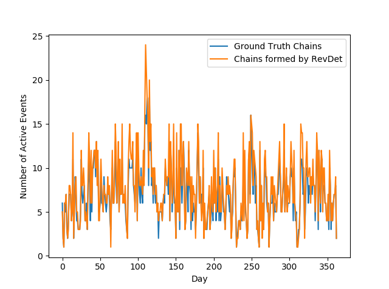
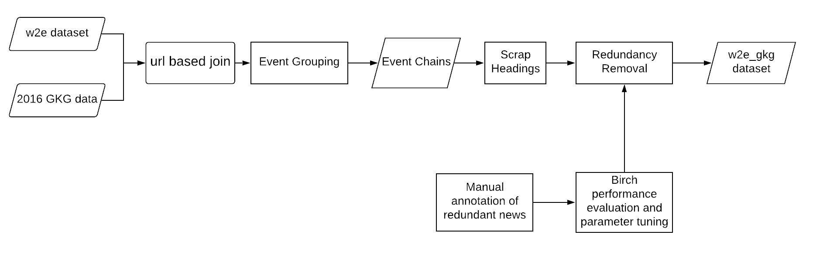
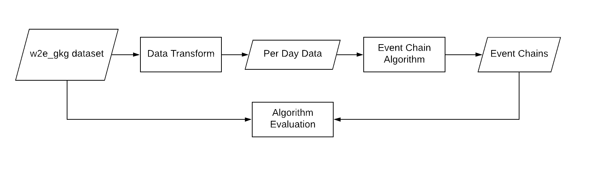

# RevDet
RevDet is an algorithm for robust and efficient event detection and tracking in large news feeds. It adopts an iterative clustering approach for tracking events.  Even though many events continue to develop for many days or even months, RevDet is able to detect and track those events while utilizing only a constant amount of space on main memory. It takes as input news articles data (with two necessary columns: a list of locations and heading) in the form of per day files (sorted by ascending timestamp of the event), window size and threshold for birch clustering algorithm. It then forms event chains and outputs each chain in a separate file.

The figure below shows per day active event chains of an year formed by our RevDet algorithm vs the ground truth chains. To form these chains, RevDet only utilized memory required for storing eight days data.

<div align='center'>
</img>
</div>

## Dataset 


The event chain algorithm has been run on the w2e_gkg dataset, which has been prepared as below:
<div align='center'>
</img>
</div>

Dataset Link: https://drive.google.com/file/d/1Xc_9FJkaYsCcNPMatlHvHmyGr7NJAPSN/view?usp=sharing

## Running RevDet

<div align='center'>
</img>
</div>

First, some pre-processing needs to be performed on the w2e_gkg dataset for removal of redundant (duplicate) news articles. Then it has to be transformed into per day files, which will serve as the input to the algorithm. Both these steps can be done by running `prepare_data.py` like this:

```bash
python3 prepare_data.py
```

You can now run the script `run_revdet.py` to run RevDet on the formed dataset and evaluate the formed chains on the ground truth chains. The plot of precision, recall, f-measure for different window sizes can be generated through:

```bash
python3 run_revdet.py --plotgraph
```

A plot of macro comparison between ground-truth and the formed chains can be generated as below:
```bash
python3 run_revdet.py --plotactivechains
```

## Other options for `run_revdet.py`

### Setting input and output directories

- `--inputchains`: Directory for redundancy removed input event chains. Default is `redundancy_removed_chains/`.
- `--outputchains`: Directory for output event chains. Default is `output_chains/`.
- `--perdaydata`: Directory for per day data. Default is `per_day_data/`.

### Algorithm Options

- `--birch_thresh`: Threshold for the birch algorithm. Default is 2.3.
- `--window_size`: Window size for the revdet algorithm. Default is 8.`.

## Reference
Azeemi, A. H., Sohail, M. H., Zubair, T., Maqbool, M., Younas, I., & Shafiq, O. (2021). RevDet: Robust and Memory Efficient Event Detection and Tracking in Large News Feeds. arXiv preprint [arXiv:2103.04390](https://arxiv.org/abs/2103.04390).
